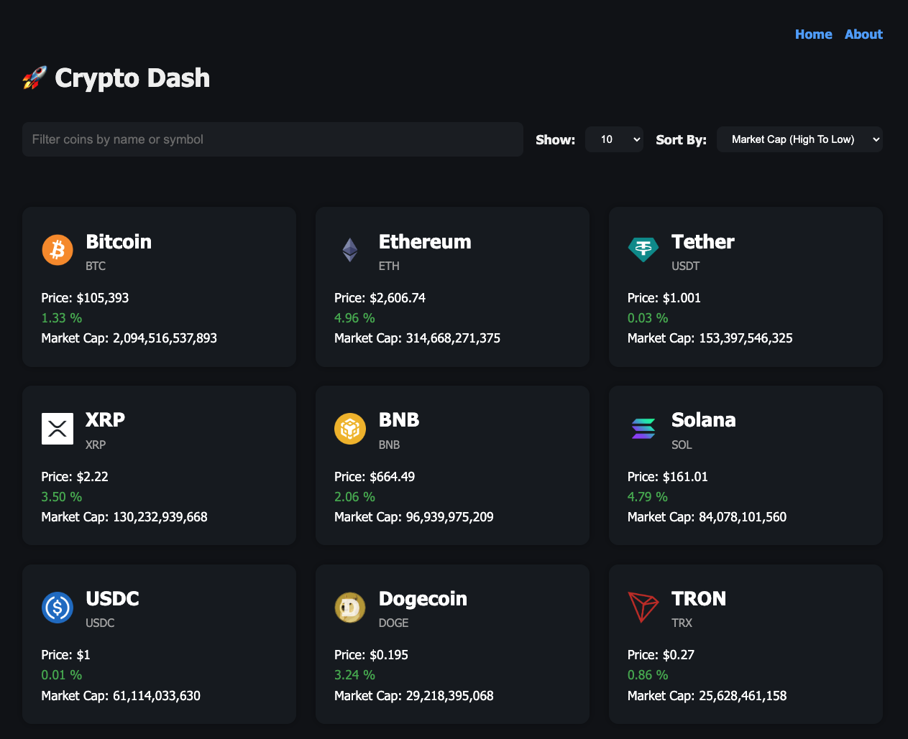

   
  
   

  

    
    
  

  <h3 align="center">Crypto Dash</h3>

  

    Crypto Dash is a simple React application that displays live cryptocurrency data using the CoinGecko API. 
    You can explore top cryptocurrencies by market cap, filter by name or symbol, and sort them by price.
  

